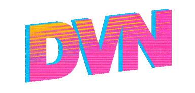

❰ [DVN](../../README.md) ❬ [Release notes](./README.md) ❬ Version 2.0

  

  <h2>Version 2.0 Release notes</h2>

Release date: 2026-10-DD
[Download](https://github.com/APrettyCoolProgram/DVN/releases/tag/v2.0)  
[Manual](../man/README.md)

***

**DVN** 2.0 is a major update that focuses on simplifying the framework and integrating basic Scoop.sh functionality.

> [!IMPORTANT]
> **DVN 2.x** is not compatible with **DVN 1.x**.
>
> **DVN 2.0** will only work on Windows operating systems; MacOS/Linux support will return in a future update.

## Scoop.sh integration

**DVN** now has basic integration with [Scoop.sh](https://scoop.sh/).

## Framework simplification

I've decided that I want DVN to focus on just managing environments, not handling other tasks, so I've removed the `.dvn/` framework structure. Now DVN just consists of the following two files:
* `dvn.exe`
* `dvn.config`
* `manifest/`

 

***

❰ [DVN](../../README.md) ❬ [Release notes](./README.md) ❬ Version 2.0
